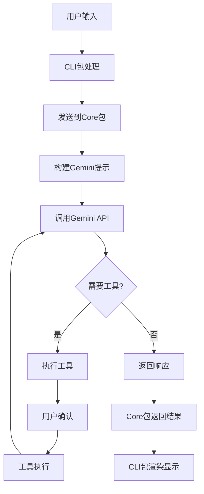

# Gemini CLI 项目详细分析

## 项目概述

Gemini CLI 是由 Google 开发的一个**命令行 AI 工作流工具**，它连接您的工具、理解您的代码并加速您的工作流程。这是一个功能强大的开源项目，基于 Google 的 Gemini AI 模型，为开发者提供智能的命令行交互体验。

### 核心功能特性

1. **大型代码库查询和编辑** - 支持在 Gemini 1M token 上下文窗口内外处理大型代码库
2. **多模态应用生成** - 可以从PDF或草图生成新应用，利用Gemini的多模态能力
3. **操作任务自动化** - 如查询pull requests或处理复杂的代码合并
4. **工具和MCP服务器集成** - 连接新功能，包括媒体生成等
5. **Google搜索集成** - 内置Google搜索工具用于信息检索

## 技术架构

### 1. 项目结构 (Monorepo 架构)

```
gemini-cli/
├── packages/
│   ├── cli/          # 用户界面层 (React + Ink)
│   └── core/         # 核心业务逻辑层
├── docs/             # 完整文档
├── integration-tests/ # 集成测试
├── scripts/          # 构建和工具脚本
└── 配置文件...
```

### 2. 核心组件架构

#### CLI 包 (`packages/cli/`)
- **用途**: 用户界面层，处理用户交互和界面渲染
- **技术栈**: React 19 + Ink (终端UI框架)
- **核心功能**:
  - 用户输入处理
  - 历史记录管理
  - 界面渲染和主题化
  - 配置管理

```typescript
// 核心源码结构
packages/cli/src/
├── ui/              # React组件和UI逻辑
│   ├── App.tsx      # 主应用组件
│   ├── components/  # 可复用组件
│   ├── themes/      # 主题系统
│   └── hooks/       # React钩子
├── config/          # 配置管理
├── utils/           # 工具函数
└── gemini.tsx       # 应用入口点
```

#### Core 包 (`packages/core/`)
- **用途**: 后端核心逻辑，与Gemini API交互和工具管理
- **核心功能**:
  - Gemini API客户端
  - 提示词构建和管理
  - 工具注册和执行
  - 会话状态管理

```typescript
// 核心源码结构  
packages/core/src/
├── core/            # 核心业务逻辑
│   ├── client.ts    # Gemini API客户端
│   ├── geminiChat.ts # 聊天管理
│   └── prompts.ts   # 提示词系统
├── tools/           # 工具系统
├── services/        # 服务层
├── config/          # 配置管理
└── utils/           # 工具函数
```

### 3. 交互流程



## 技术栈详解

### 前端技术
- **React 19**: 最新的React版本，支持并发特性
- **Ink**: Facebook开发的终端UI框架，用React构建CLI应用
- **TypeScript**: 全面的类型安全

### 后端技术
- **Node.js 20+**: 运行时环境
- **Google Generative AI SDK**: Gemini API集成
- **WebSocket**: MCP服务器通信
- **ESBuild**: 快速打包构建

### 开发工具
- **Vitest**: 现代化测试框架
- **ESLint**: 代码质量检查
- **Prettier**: 代码格式化
- **Monorepo**: 多包管理

## 核心功能模块

### 1. 工具系统 (`packages/core/src/tools/`)

工具系统是项目的扩展机制核心，支持多种工具类型：

```typescript
// 内置工具示例
- read-file.ts        # 文件读取
- write-file.ts       # 文件写入
- edit.ts            # 文件编辑
- shell.ts           # Shell命令执行
- grep.ts            # 文件搜索
- web-search.ts      # 网络搜索
- mcp-client.ts      # MCP服务器集成
```

#### 工具注册机制
```typescript
export class ToolRegistry {
  private tools: Map<string, Tool> = new Map();
  
  registerTool(tool: Tool): void {
    this.tools.set(tool.name, tool);
  }
  
  async discoverTools(): Promise<void> {
    // 自动发现项目工具
    // 集成MCP服务器
  }
}
```

### 2. 认证系统

支持多种认证方式：
- **Gemini API Key**: 直接使用API密钥
- **OAuth2**: Google账户登录
- **服务账户**: 企业级认证

### 3. 配置系统

层次化配置管理：
```json
// .gemini/settings.json
{
  "selectedAuthType": "USE_GEMINI",
  "theme": "default", 
  "model": "gemini-2.5-pro",
  "excludeTools": [],
  "mcpServers": {}
}
```

### 4. 沙箱环境

支持Docker/Podman沙箱执行，确保安全性：
```typescript
// 沙箱配置
config: {
  sandboxImageUri: "us-docker.pkg.dev/gemini-code-dev/gemini-cli/sandbox:0.1.9"
}
```

## 二次开发指南

### 1. 开发环境设置

```bash
# 克隆项目
git clone https://github.com/google-gemini/gemini-cli.git
cd gemini-cli

# 安装依赖 (Node.js 20+)
npm ci

# 构建项目
npm run build

# 运行测试
npm run test

# 启动开发模式
npm run start
```

### 2. 自定义工具开发

#### 创建新工具

```typescript
// packages/core/src/tools/my-custom-tool.ts
import { BaseTool, ToolResult } from './tools.js';

interface MyToolParams {
  input: string;
  options?: Record<string, unknown>;
}

export class MyCustomTool extends BaseTool<MyToolParams, ToolResult> {
  constructor() {
    super(
      'my_custom_tool',
      'My Custom Tool',
      'Description of what this tool does',
      {
        type: 'object',
        properties: {
          input: { type: 'string', description: 'Input parameter' },
          options: { type: 'object', description: 'Optional parameters' }
        },
        required: ['input']
      }
    );
  }

  async execute(params: MyToolParams): Promise<ToolResult> {
    // 实现工具逻辑
    const result = await this.processInput(params.input);
    
    return {
      llmContent: result,
      returnDisplay: `Processed: ${result}`
    };
  }

  private async processInput(input: string): Promise<string> {
    // 自定义处理逻辑
    return `Processed: ${input}`;
  }
}
```

#### 注册工具

```typescript
// packages/core/src/tools/tool-registry.ts
import { MyCustomTool } from './my-custom-tool.js';

// 在工具注册中添加
export async function registerCustomTools(registry: ToolRegistry) {
  registry.registerTool(new MyCustomTool());
}
```

### 3. UI组件扩展

#### 创建新的React组件

```tsx
// packages/cli/src/ui/components/MyComponent.tsx
import React from 'react';
import { Box, Text } from 'ink';

interface MyComponentProps {
  title: string;
  content: string;
}

export const MyComponent: React.FC<MyComponentProps> = ({ title, content }) => {
  return (
    <Box flexDirection="column">
      <Text color="blue" bold>{title}</Text>
      <Text>{content}</Text>
    </Box>
  );
};
```

### 4. 配置扩展

#### 添加新的配置选项

```typescript
// packages/core/src/config/config.ts
export interface UserSettings {
  // 现有配置...
  myCustomSetting?: string;
  myFeatureEnabled?: boolean;
}

// 在Config类中添加getter方法
export class Config {
  getMyCustomSetting(): string | undefined {
    return this.userSettings.myCustomSetting;
  }
}
```

### 5. 命令扩展

#### 添加新的斜杠命令

```typescript
// packages/cli/src/ui/components/CommandHandler.tsx
const handleSlashCommand = (command: string) => {
  const [cmd, ...args] = command.slice(1).split(' ');
  
  switch (cmd) {
    case 'mycmd':
      return handleMyCustomCommand(args);
    // 其他命令...
  }
};

const handleMyCustomCommand = (args: string[]) => {
  // 实现自定义命令逻辑
};
```

### 6. MCP服务器集成

#### 配置MCP服务器

```json
{
  "mcpServers": {
    "my-server": {
      "command": "node",
      "args": ["path/to/my-mcp-server.js"]
    }
  }
}
```

#### 开发MCP服务器

```typescript
// my-mcp-server.js
import { Server } from '@modelcontextprotocol/sdk/server/index.js';

const server = new Server({
  name: 'my-custom-server',
  version: '1.0.0'
});

server.setRequestHandler('tools/list', async () => ({
  tools: [{
    name: 'my_tool',
    description: 'My custom MCP tool',
    inputSchema: {
      type: 'object',
      properties: {
        query: { type: 'string' }
      }
    }
  }]
}));
```

### 7. 测试开发

#### 单元测试

```typescript
// packages/core/src/tools/my-custom-tool.test.ts
import { describe, it, expect } from 'vitest';
import { MyCustomTool } from './my-custom-tool.js';

describe('MyCustomTool', () => {
  it('should process input correctly', async () => {
    const tool = new MyCustomTool();
    const result = await tool.execute({ input: 'test' });
    
    expect(result.llmContent).toContain('Processed: test');
  });
});
```

#### 集成测试

```typescript
// integration-tests/my-feature.test.ts
import { runCliTest } from './test-utils.js';

describe('My Feature Integration', () => {
  it('should work end-to-end', async () => {
    const result = await runCliTest('my custom command');
    expect(result).toContain('expected output');
  });
});
```

## 部署和发布

### 1. 构建流程

```bash
# 完整构建检查
npm run preflight

# 构建包
npm run build:packages

# 构建沙箱
npm run build:sandbox
```

### 2. 发布流程

```bash
# 版本管理
npm run release:version

# 发布到npm
npm run publish:release
```

### 3. Docker部署

```dockerfile
# 自定义Dockerfile示例
FROM node:20-alpine
WORKDIR /app
COPY . .
RUN npm ci && npm run build
CMD ["npm", "start"]
```

## 最佳实践

### 1. 代码风格
- 使用TypeScript严格模式
- 遵循ESLint规则
- 优先使用函数式组件和React Hooks
- 避免使用`any`类型，优先使用`unknown`

### 2. 架构原则
- 模块化设计，清晰的职责分离
- 使用ES模块进行封装
- 优先使用plain objects而不是classes
- 实现工具的可扩展性

### 3. 测试策略
- 编写全面的单元测试
- 关键功能需要集成测试
- 使用Vitest测试框架
- Mock外部依赖

### 4. 性能优化
- 利用React Compiler优化
- 避免不必要的re-render
- 合理使用缓存机制
- 大文件处理需要分块

## 扩展开发示例

### 完整的自定义工具示例

```typescript
// packages/core/src/tools/database-query.ts
import { BaseTool, ToolResult } from './tools.js';
import { DatabaseConnection } from '../services/database.js';

interface DatabaseQueryParams {
  query: string;
  database?: string;
  limit?: number;
}

export class DatabaseQueryTool extends BaseTool<DatabaseQueryParams, ToolResult> {
  private db: DatabaseConnection;

  constructor(config: Config) {
    super(
      'database_query',
      'Database Query',
      'Execute SQL queries against configured databases',
      {
        type: 'object',
        properties: {
          query: { 
            type: 'string', 
            description: 'SQL query to execute' 
          },
          database: { 
            type: 'string', 
            description: 'Database name (optional)' 
          },
          limit: { 
            type: 'number', 
            description: 'Result limit (default: 100)',
            default: 100
          }
        },
        required: ['query']
      },
      false, // isOutputMarkdown
      false  // canUpdateOutput
    );
    
    this.db = new DatabaseConnection(config.getDatabaseConfig());
  }

  async execute(params: DatabaseQueryParams): Promise<ToolResult> {
    try {
      const results = await this.db.query(
        params.query,
        params.database,
        params.limit || 100
      );
      
      const formatted = this.formatResults(results);
      
      return {
        llmContent: `Query executed successfully. Found ${results.length} results:\n${formatted}`,
        returnDisplay: formatted
      };
    } catch (error) {
      return {
        llmContent: `Query failed: ${error.message}`,
        returnDisplay: `Error: ${error.message}`
      };
    }
  }

  private formatResults(results: any[]): string {
    if (results.length === 0) return 'No results found.';
    
    // 简单的表格格式化
    const headers = Object.keys(results[0]);
    const rows = results.map(row => 
      headers.map(h => String(row[h] || '')).join('\t')
    );
    
    return [headers.join('\t'), ...rows].join('\n');
  }
}
```

这个项目为AI驱动的开发工具提供了一个优秀的架构模板，具有良好的扩展性和可维护性。通过理解其核心设计模式，您可以构建自己的AI工具集成和工作流程自动化解决方案。